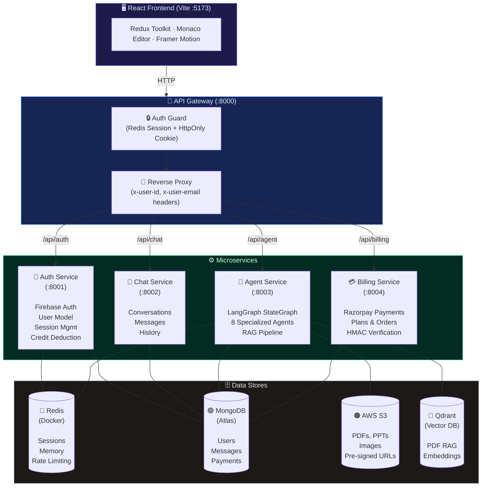

<p align="center">
  <h1 align="center">🧠 NexusAI</h1>
  <p align="center">
    <em>A Distributed Multi-Agent AI Platform with Microservices Orchestration</em>
  </p>
  <p align="center">
    
    
    
    
    
    
  </p>
</p>

---

## 📖 Table of Contents

- [Overview](#-overview)
- [Architecture](#-architecture)
- [Key Features](#-key-features)
- [Tech Stack](#-tech-stack)
- [Project Structure](#-project-structure)
- [Prerequisites](#-prerequisites)
- [Environment Variables](#-environment-variables)
- [Getting Started](#-getting-started)
- [API Reference](#-api-reference)
- [Agent System](#-agent-system)
- [Credit & Billing System](#-credit--billing-system)
- [Authentication & Security](#-authentication--security)
- [Rate Limiting](#-rate-limiting)
- [Frontend](#-frontend)
- [Docker](#-docker)
- [Contributing](#-contributing)
- [License](#-license)

---

## 🌐 Overview

**NexusAI** is a production-grade, full-stack AI platform that orchestrates **8 specialized AI agents** behind a unified chat interface. Users can have conversations, generate code with live preview, create PDFs and presentations, perform web searches, generate images, analyze uploaded images, and query PDF documents using Retrieval-Augmented Generation (RAG) — all through a single prompt.

The backend is decomposed into **4 independent microservices** fronted by a centralized API Gateway, with Redis-backed session management, per-agent rate limiting, a tiered credit system, and integrated Razorpay billing.

---

## 🏗 Architecture



---

## ✨ Key Features

| Feature | Description |
|---|---|
| 🤖 **Multi-Agent Orchestration** | 8 specialized agents orchestrated via a LangGraph StateGraph with a supervisor router |
| 💬 **Conversational AI** | Multi-turn chat with Redis-backed sliding-window memory (20 messages, 24h TTL) |
| 💻 **Code Generation & Preview** | Full-stack code generation with in-browser Monaco Editor and live sandboxed iframe preview |
| 📄 **PDF Generation** | AI-generated professional PDF documents, uploaded to S3 with pre-signed download links |
| 📊 **PPT Generation** | Multi-slide PPTX presentations with cover, bullet, stats, and conclusion slide types |
| 🖼️ **Image Generation** | LLM-enhanced prompt engineering + Pollinations.ai image synthesis, stored on S3 |
| 👁️ **Vision Analysis** | Upload images for AI-powered analysis, text extraction, and chart interpretation (Gemini 2.5 Flash) |
| 📚 **PDF RAG** | Upload PDFs → chunk → embed → vector search (Qdrant) → contextual Q&A with ephemeral cleanup |
| 🌐 **Web Search** | Real-time web search via Tavily API with results fed into the chat agent for grounded responses |
| 🎙️ **Voice Input** | Web Speech API integration for hands-free voice-to-text prompting |
| 🔐 **Firebase Auth** | Google and GitHub OAuth login with Firebase, server-side token verification |
| 💳 **Billing & Payments** | Razorpay-integrated tiered plans (Free / Starter / Pro) with HMAC-SHA256 payment verification |
| 🛡️ **Rate Limiting** | Per-user, per-agent Redis-backed rate limiting with atomic INCR/EXPIRE operations |
| 💰 **Credit System** | Granular per-agent credit costs with real-time balance propagation to the session cache |
| 🚀 **One-Click Deploy** | Instantly deploy generated HTML/CSS/JS frontend projects to a live, public AWS S3 URL from the Artifact panel |
| 🔎 **Conversation Search** | Client-side fuzzy search across conversation titles with date-grouped sections (Pinned, Today, Yesterday, Older) |
| 🔄 **Auth Loading Gate** | Splash-screen loading state during session validation to eliminate login-page flash on refresh |
| 🛑 **401 Auto-Logout** | Axios response interceptor that automatically clears session and redirects to login on 401 responses |
| 📋 **Message Actions** | Per-message icon-only hover toolbar with Copy, Regenerate (re-call agent with preceding user prompt), and Delete with two-click confirmation (persisted to backend) |

---

## 🛠 Tech Stack

### Backend

| Layer | Technology |
|---|---|
| Runtime | Node.js |
| Framework | Express 5 |
| Database | MongoDB (Mongoose) |
| Cache / Sessions | Redis (ioredis) |
| Vector Database | Qdrant |
| AI Orchestration | LangChain, LangGraph (StateGraph) |
| LLM Providers | Google Gemini 2.5 Flash, Groq (Llama 3.3 70B), DeepSeek (via OpenRouter) |
| Embeddings | Google `gemini-embedding-001` |
| Web Search | Tavily Search API |
| Object Storage | AWS S3 (Pre-signed URLs via `@aws-sdk/s3-request-presigner`) |
| Authentication | Firebase Admin SDK |
| Payments | Razorpay |
| Document Gen | PDFKit, PPTXGenJS |
| File Upload | Multer |
| Security | Helmet, CORS, HttpOnly Cookies, HMAC-SHA256 |
| Gateway Proxy | express-http-proxy |
| Containerization | Docker Compose |

### Frontend

| Layer | Technology |
|---|---|
| Framework | React 19 |
| Build Tool | Vite 8 |
| State Management | Redux Toolkit |
| Styling | Tailwind CSS 4 |
| Code Editor | Monaco Editor (`@monaco-editor/react`) |
| Animations | Framer Motion |
| Markdown | react-markdown, remark-gfm, react-syntax-highlighter |
| Icons | Lucide React, React Icons |
| HTTP Client | Axios |
| Auth Provider | Firebase (Google + GitHub OAuth) |
| Voice Input | Web Speech API |
| Routing | React Router DOM v7 |

---

## 📁 Project Structure

```
nexus-ai/
├── backend/
│   ├── docker-compose.yml          # Redis container
│   ├── package.json                 # Root workspace config
│   ├── shared/
│   │   └── redis/
│   │       └── redis.js             # Shared Redis client (ioredis)
│   ├── gateway/                     # API Gateway (:8000)
│   │   ├── index.js                 # Express server, proxy routing
│   │   ├── Dockerfile
│   │   ├── controllers/
│   │   │   └── user.controller.js   # GET /api/me — return session user
│   │   ├── middlewares/
│   │   │   └── auth.middleware.js    # Cookie → Redis session validation
│   │   └── utils/
│   │       └── proxyWithHeaders.js  # Inject x-user-* headers on proxy
│   ├── services/
│   │   ├── auth/                    # Auth Service (:8001)
│   │   │   ├── index.js
│   │   │   ├── Dockerfile
│   │   │   ├── config/
│   │   │   │   └── firebase.js      # Firebase Admin SDK init
│   │   │   ├── controllers/
│   │   │   │   └── auth.controllers.js  # login, logout, updatePlan, deductCredits
│   │   │   ├── models/
│   │   │   │   └── user.model.js    # User schema (plan, credits, timestamps)
│   │   │   └── routes/
│   │   ├── chat/                    # Chat Service (:8002)
│   │   │   ├── index.js
│   │   │   ├── Dockerfile
│   │   │   ├── controllers/
│   │   │   │   └── chat.controller.js   # CRUD conversations, messages (create, list, save, delete)
│   │   │   └── models/
│   │   │       ├── conversation.model.js
│   │   │       └── message.model.js     # Messages with artifacts & images
│   │   ├── agent/                   # Agent Service (:8003)
│   │   │   ├── index.js
│   │   │   ├── Dockerfile
│   │   │   ├── graph/
│   │   │   │   ├── state.js             # AgentState annotation schema
│   │   │   │   ├── router.node.js       # Two-phase intent classifier
│   │   │   │   └── supervisor.graph.js  # LangGraph StateGraph compilation
│   │   │   ├── agents/
│   │   │   │   ├── chat.agent.js        # Conversational AI with memory
│   │   │   │   ├── coding.agent.js      # Code generation & review
│   │   │   │   ├── search.agent.js      # Tavily web search
│   │   │   │   ├── pdf.agent.js         # PDF document generation
│   │   │   │   ├── ppt.agent.js         # PPTX presentation generation
│   │   │   │   ├── imageGen.agent.js    # AI image generation
│   │   │   │   ├── vision.agent.js      # Multimodal image analysis
│   │   │   │   └── pdfRag.agent.js      # PDF RAG pipeline
│   │   │   ├── config/
│   │   │   │   └── agentRateLimit.js    # Per-agent Redis rate limiter
│   │   │   └── utils/
│   │   │       ├── model.js             # LLM provider routing
│   │   │       ├── memory.js            # Redis conversation memory
│   │   │       ├── embedding.js         # Google embedding model
│   │   │       ├── vectorStore.js       # Qdrant vector store factory
│   │   │       ├── tavily.js            # Tavily search tool config
│   │   │       ├── s3.js                # AWS S3 client
│   │   │       ├── uploadToS3.js        # S3 PutObject wrapper
│   │   │       ├── getDownloadUrl.js    # S3 pre-signed URL generator
│   │   │       └── deductCredits.js     # Cross-service credit deduction
│   │   └── billing/                 # Billing Service (:8004)
│   │       ├── index.js
│   │       ├── Dockerfile
│   │       ├── config/
│   │       │   ├── plans.js             # Plan definitions (Free, Starter, Pro)
│   │       │   ├── credits.js           # Per-agent credit costs
│   │       │   ├── razorpay.js          # Razorpay SDK init
│   │       │   └── db.js               # MongoDB connection
│   │       ├── controllers/
│   │       │   └── billing.controller.js  # createOrder, verifyPayment
│   │       └── models/
│   │           └── payment.model.js     # Payment schema (order, status, credits)
├── frontend/
│   ├── index.html
│   ├── firebase.js                  # Firebase client SDK (Google + GitHub Auth)
│   ├── vite.config.js
│   ├── package.json
│   └── src/
│       ├── App.jsx                  # Router setup with auth loading gate + splash screen
│       ├── main.jsx                 # Redux Provider + React entry
│       ├── pages/
│       │   └── Home.jsx             # Main layout (Sidebar + Chat + Artifacts)
│       ├── components/
│       │   ├── Sidebar.jsx          # Conversation list with search, date grouping, new chat, logout
│       │   ├── Navbar.jsx           # Top bar
│       │   ├── ChatArea.jsx         # Chat container
│       │   ├── ChatInput.jsx        # Prompt input, agent selector, voice, file upload
│       │   ├── MessageList.jsx      # Message rendering
│       │   ├── MessageBubble.jsx    # Message rendering + hover toolbar (copy, regenerate, delete)
│       │   ├── ArtifactPanel.jsx    # Code editor + live preview panel
│       │   ├── AiBanner.jsx         # Welcome banner with suggested prompts
│       │   ├── BillingDrawer.jsx    # Plans & credits drawer with Razorpay checkout
│       │   └── ModelSelector.jsx    # Model selection UI
│       ├── redux/
│       │   ├── store.js             # Redux store (user, conversation, message)
│       │   ├── user.slice.js
│       │   ├── conversation.slice.js
│       │   └── message.slice.js
│       ├── features/
│       │   ├── agent.api.js         # POST /api/agent/chat
│       │   ├── billing.api.js       # POST /api/billing/create-order
│       │   ├── conversation.api.js  # Conversation CRUD
│       │   └── message.api.js       # Message fetch, save, delete
│       ├── hooks/
│       │   └── useCurrentUser.jsx   # Fetch session user on mount with auth loading state
│       └── utils/
│           ├── axios.js             # Axios instance with credentials + 401 auto-logout interceptor
│           └── detectLanguage.js    # File extension → Monaco language mapping
```

---

## 📋 Prerequisites

- **Node.js** v18+
- **Docker** & **Docker Compose** (for Redis)
- **MongoDB** instance (local or MongoDB Atlas)
- **Firebase** project with Authentication enabled (Google + GitHub providers)
- **AWS** account with an S3 bucket
- **Razorpay** account (for billing — test mode works)
- API keys for: **Google Gemini**, **Groq**, **OpenRouter**, **Tavily**, **Qdrant**

---

## 🔑 Environment Variables

### Gateway (`backend/gateway/.env`)

```env
PORT=8000
REDIS_URL="redis://localhost:6379"
AUTH_SERVICE="http://localhost:8001"
CHAT_SERVICE="http://localhost:8002"
AGENT_SERVICE="http://localhost:8003"
BILLING_SERVICE="http://localhost:8004"
```

### Auth Service (`backend/services/auth/.env`)

```env
PORT=8001
MONGODB_URL=<your-mongodb-connection-string>
```

### Chat Service (`backend/services/chat/.env`)

```env
PORT=8002
MONGODB_URL=<your-mongodb-connection-string>
```

### Agent Service (`backend/services/agent/.env`)

```env
PORT=8003
MONGODB_URL=<your-mongodb-connection-string>
GOOGLE_API_KEY=<your-google-gemini-api-key>
GROQ_API_KEY=<your-groq-api-key>
OPENROUTER_API_KEY=<your-openrouter-api-key>
TAVILY_API_KEY=<your-tavily-api-key>
QDRANT_URL=<your-qdrant-url>
QDRANT_API_KEY=<your-qdrant-api-key>
AWS_ACCESS_KEY_ID=<your-aws-access-key>
AWS_SECRET_ACCESS_KEY=<your-aws-secret-key>
AWS_REGION="ap-south-1"
AWS_BUCKET_NAME=<your-s3-bucket-name>
CHAT_SERVICE=http://localhost:8002
AUTH_SERVICE=http://localhost:8001
GATEWAY_URL=http://localhost:8000
```

### Billing Service (`backend/services/billing/.env`)

```env
PORT=8004
MONGODB_URL=<your-mongodb-connection-string>
AUTH_SERVICE="http://localhost:8001"
RAZORPAY_KEY_ID=<your-razorpay-key-id>
RAZORPAY_KEY_SECRET=<your-razorpay-key-secret>
```

### Frontend (`frontend/.env`)

```env
VITE_FIREBASE_API_KEY=<your-firebase-api-key>
VITE_RAZORPAY_KEY=<your-razorpay-key-id>
```

---

## 🚀 Getting Started

### 1. Clone the Repository

```bash
git clone https://github.com/Vedant1521/nexus-ai.git
cd nexus-ai
```

### 2. Start Redis (Docker)

```bash
cd backend
docker compose up
```

This starts a Redis container on `localhost:6379`.

### 3. Install Dependencies & Start Backend Services

Open **5 separate terminals** and run each service:

**Terminal 1 — Gateway**
```bash
cd backend/gateway
npm install
npm run dev
```

**Terminal 2 — Auth Service**
```bash
cd backend/services/auth
npm install
npm run dev
```

**Terminal 3 — Chat Service**
```bash
cd backend/services/chat
npm install
npm run dev
```

**Terminal 4 — Agent Service**
```bash
cd backend/services/agent
npm install
npm run dev
```

**Terminal 5 — Billing Service**
```bash
cd backend/services/billing
npm install
npm run dev
```

### 4. Start the Frontend

```bash
cd frontend
npm install
npm run dev
```

The app will be available at **`http://localhost:5173`**.

---

## 📡 API Reference

All requests go through the **API Gateway** at `http://localhost:8000`.

### Authentication

| Method | Endpoint | Auth | Description |
|---|---|---|---|
| `POST` | `/api/auth/login` | ❌ | Login with Firebase ID token. Sets HttpOnly session cookie. |
| `GET` | `/api/auth/logout` | ❌ | Clears session from Redis and removes cookie. |
| `GET` | `/api/me` | ✅ | Returns current user from Redis session. |

### Chat / Conversations

| Method | Endpoint | Auth | Description |
|---|---|---|---|
| `POST` | `/api/chat/create-conversation` | ✅ | Create a new conversation. |
| `GET` | `/api/chat/conversations` | ✅ | List all conversations (sorted by `updatedAt` desc). |
| `GET` | `/api/chat/get-messages/:id` | ✅ | Get all messages for a conversation. |
| `POST` | `/api/chat/save-message` | ✅ | Save a message (used internally by agent service). |
| `POST` | `/api/chat/delete-message` | ✅ | Delete a message by ID. |
| `PATCH` | `/api/chat/update-conversation` | ✅ | Update conversation title. |

### Agent

| Method | Endpoint | Auth | Description |
|---|---|---|---|
| `POST` | /api/agent/chat | ✅ | Send a prompt to the agent orchestrator. Supports `multipart/form-data` for file uploads. |
| `POST` | /api/agent/deploy | ✅ | Deploy the current code files in the active artifact to a public S3 bucket and return a live URL. |

**Request Body (form-data):**

| Field | Type | Description |
|---|---|---|
| `prompt` | `string` | The user's message |
| `conversationId` | `string` | Active conversation ID |
| `agent` | `string` | Agent override (`auto`, `chat`, `coding`, `pdf`, `ppt`, `image`, `search`) |
| `file` | `file` | Optional file attachment (image or PDF) |

### Billing

| Method | Endpoint | Auth | Description |
|---|---|---|---|
| `POST` | `/api/billing/create-order` | ✅ | Create a Razorpay order for a plan (`starter` or `pro`). |
| `POST` | `/api/billing/verify-payment` | ✅ | Verify Razorpay payment signature (HMAC-SHA256). |

### Internal (Service-to-Service)

| Method | Endpoint | Service | Description |
|---|---|---|---|
| `PATCH` | `/internal/update-plan` | Auth | Update user plan & credits after payment verification. |
| `PATCH` | `/internal/deduct-credits` | Auth | Deduct credits for an agent invocation. |

---

## 🤖 Agent System

### LangGraph StateGraph

The agent service compiles a **directed acyclic graph** using LangGraph's `StateGraph`:

```
[__start__] → [router] → ┬─ [chat]    → [__end__]
                          ├─ [coding]  → [__end__]
                          ├─ [search]  → [chat] → [__end__]
                          ├─ [pdf]     → [__end__]
                          ├─ [ppt]     → [__end__]
                          ├─ [image]   → [__end__]
                          ├─ [vision]  → [__end__]
                          └─ [pdf_rag] → [__end__]
```

> Note: The `search` agent chains into the `chat` agent — search results are used as context for a grounded response.

### Router Node — Two-Phase Classification

1. **Fast-Path (Deterministic):** If a file is attached, the router inspects the MIME type:
   - `image/*` → routes to `vision` agent
   - `application/pdf` → routes to `pdf_rag` agent
2. **Semantic Fallback:** If no file or agent override, the router invokes an LLM to classify the prompt into one of: `chat`, `search`, `coding`, `pdf`, `ppt`, `image`.

### Agent Descriptions

| Agent | LLM Provider | Description |
|---|---|---|
| **Chat** | Groq (Llama 3.3 70B) | General conversation with multi-turn memory. Also serves as the response synthesizer for search results. |
| **Coding** | DeepSeek (OpenRouter) | Code generation (HTML/CSS/JS projects), code review, debugging, optimization. Returns structured `FILE:` blocks parsed into artifacts. |
| **Search** | Tavily API | Web search with top-5 results + image extraction. Results fed to chat agent. |
| **PDF** | Groq (Llama 3.3 70B) | Generates professional PDF documents via PDFKit, uploaded to S3. |
| **PPT** | Groq (Llama 3.3 70B) | Generates 8+ slide PPTX presentations via PPTXGenJS with cover, bullet, stat, and conclusion slide types. Uploaded to S3. |
| **Image** | Groq (Llama 3.3 70B) + Pollinations.ai | LLM enhances the prompt → Pollinations.ai generates the image → uploaded to S3. |
| **Vision** | Google Gemini 2.5 Flash | Multimodal image analysis — text extraction, chart interpretation, visual Q&A. Base64 encoding. |
| **PDF RAG** | Groq (Llama 3.3 70B) | Ephemeral RAG: parse PDF → chunk (1000 chars, 200 overlap) → embed (gemini-embedding-001) → Qdrant vector search (top-5) → contextual answer → deterministic cleanup (file unlink + collection deletion). Rate-limited (5 req/min) and credit-metered (5 credits/request). |

### Conversation Memory

- Stored in **Redis** with key `conversation:{conversationId}`
- **Sliding window**: capped at 20 messages (oldest evicted via `shift()`)
- **TTL**: 24 hours (`86400` seconds)
- **Cache-aside pattern**: on cache miss, fetches from Chat service's MongoDB and populates Redis

---

## 💰 Credit & Billing System

### Plans

| Plan | Price (INR) | Credits | Validity |
|---|---|---|---|
| **Free** | ₹0 | 100 | 30 days |
| **Starter** | ₹199 | 500 | 30 days |
| **Pro** | ₹499 | 1,000 | 30 days |

### Credit Costs per Agent

| Agent | Cost (Credits) |
|---|---|
| Chat | 1 |
| Search | 5 |
| Coding | 10 |
| PDF | 10 |
| PPT | 10 |
| Image | 10 |
| PDF RAG | 5 |

### Payment Flow

1. Frontend calls `POST /api/billing/create-order` with the plan name
2. Billing service creates a Razorpay order and stores it in MongoDB with status `created`
3. Frontend opens the Razorpay checkout modal
4. On payment success, frontend calls `POST /api/billing/verify-payment` with `razorpay_order_id`, `razorpay_payment_id`, and `razorpay_signature`
5. Billing service verifies the HMAC-SHA256 signature: `SHA256(razorpay_order_id|razorpay_payment_id, secret)`
6. On verification, payment status is updated to `paid` and the auth service is called to update the user's plan and credits
7. The Redis session cache is immediately refreshed so the frontend reflects the new balance without requiring a re-login

---

## 🔐 Authentication & Security

### Session Lifecycle

1. User signs in via Firebase (Google or GitHub OAuth) on the frontend
2. Frontend sends the Firebase ID token to `POST /api/auth/login`
3. Auth service verifies the token via `firebase-admin` SDK
4. A `crypto.randomUUID()` session ID is generated
5. Two Redis keys are set (both with 7-day TTL):
   - `session:{sessionId}` → serialized user data (userId, email, plan, credits)
   - `user-session:{userId}` → sessionId (for reverse lookup during plan updates)
6. An **HttpOnly** cookie named `session` is set with `sameSite: "lax"` and `maxAge: 7 days`

### Gateway Auth Guard

Every protected route goes through the `protect` middleware:
1. Extract `session` cookie from the request
2. Lookup `session:{sessionId}` in Redis
3. If found → attach `req.user` and continue
4. If not found → return `401 Unauthorized`

### Security Headers

- **Helmet** middleware sets security headers (CSP, HSTS, X-Frame-Options, etc.)
- **CORS** restricted to `http://localhost:5173` with credentials enabled
- No raw tokens or passwords are ever forwarded to downstream services

---

## 🚦 Rate Limiting

Each agent has an independent **per-user** rate limit enforced via Redis:

| Agent | Max Requests / Minute |
|---|---|
| Chat | 20 |
| Coding | 5 |
| PDF | 5 |
| PPT | 5 |
| Image | 3 |
| Search | 5 |
| PDF RAG | 5 |

### Implementation

- Key: `rate:{agent}:{userId}`
- On first request: `INCR` key + `EXPIRE` with 60-second TTL
- On subsequent requests: `INCR` key, check against limit
- On breach: returns `429 Too Many Requests` with `retryAfter` countdown

---

## 🎨 Frontend

### Key Components

| Component | Purpose |
|---|---|
| **Sidebar** | Conversation history with client-side search and date-grouped sections (Pinned, Today, Yesterday, Older), new chat, user profile, logout, billing drawer trigger |
| **ChatInput** | Prompt input with agent selector pills (Auto, Chat, Coding, PDF, PPT, Image, Search), voice input toggle, file attachment |
| **MessageBubble** | Renders user/assistant messages with `react-markdown`, `remark-gfm`, and `react-syntax-highlighter`. Hover toolbar with Copy (clipboard), Regenerate (re-call agent), and Delete (backend-persisted) actions |
| **ArtifactPanel** | Collapsible side panel with Monaco Editor (code view) and sandboxed iframe (live preview). File tab navigation for multi-file projects. |
| **BillingDrawer** | Slide-out drawer showing current plan, credit usage bar, and upgrade options with integrated Razorpay checkout |

### State Management (Redux Toolkit)

| Slice | State |
|---|---|
| `user` | `userData`, `isAuthLoading`, `authError` |
| `conversation` | `conversations[]`, `selectedConversation` |
| `message` | `messages[]`, `artifacts[]`, `isLoading` — actions: `setMessages`, `addMessage`, `removeMessage`, `updateMessage`, `setIsLoading`, `setArtifacts` |

---

## 🐳 Docker

Currently, Docker Compose is used for the **Redis** dependency:

```bash
cd backend
docker compose up
```

Individual service `Dockerfile`s are included for containerized deployment of each microservice.

---

## 🤝 Contributing

1. Fork the repository
2. Create a feature branch (`git checkout -b feature/amazing-feature`)
3. Commit your changes (`git commit -m 'Add amazing feature'`)
4. Push to the branch (`git push origin feature/amazing-feature`)
5. Open a Pull Request

---

## 📄 License

This project is licensed under the **ISC License**.

---

<p align="center">
  Built with ❤️ by the NexusAI team
</p>
